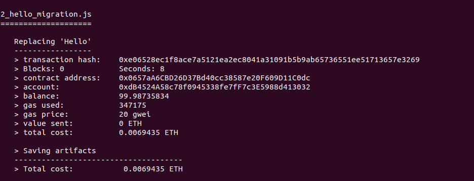
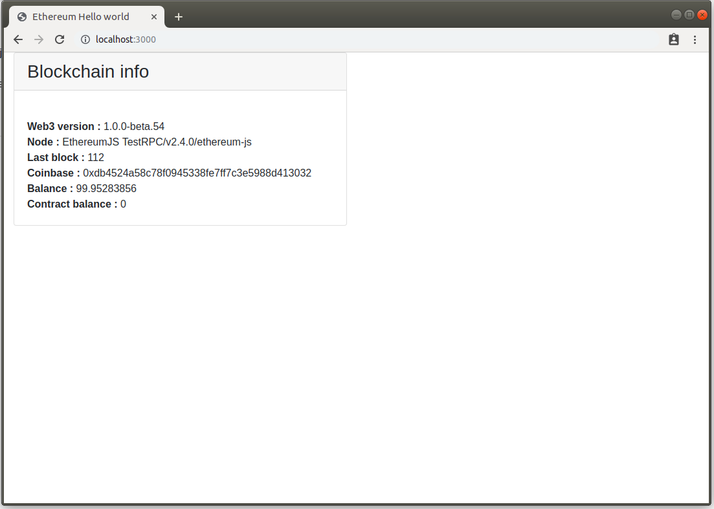
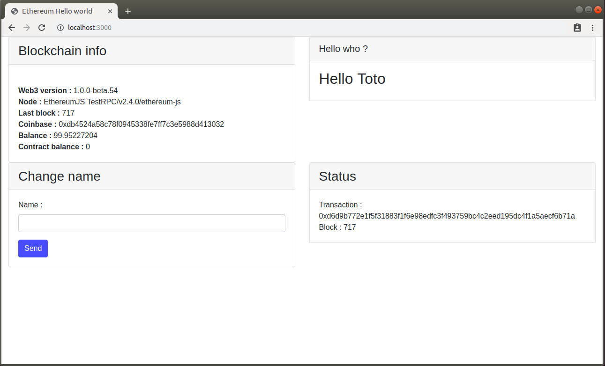
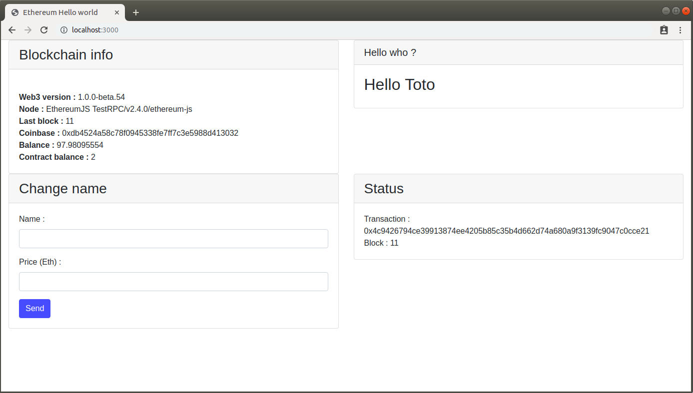
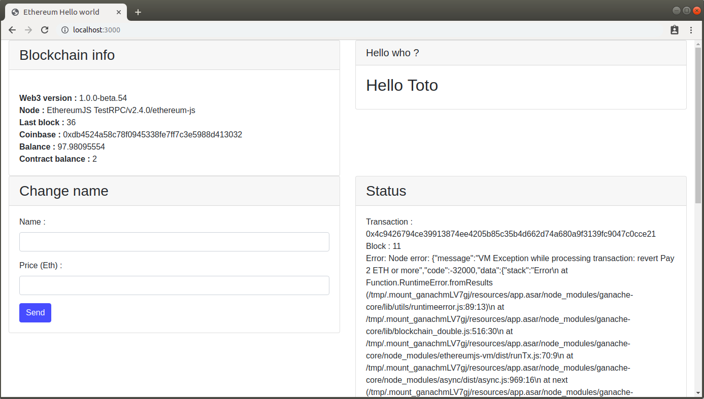
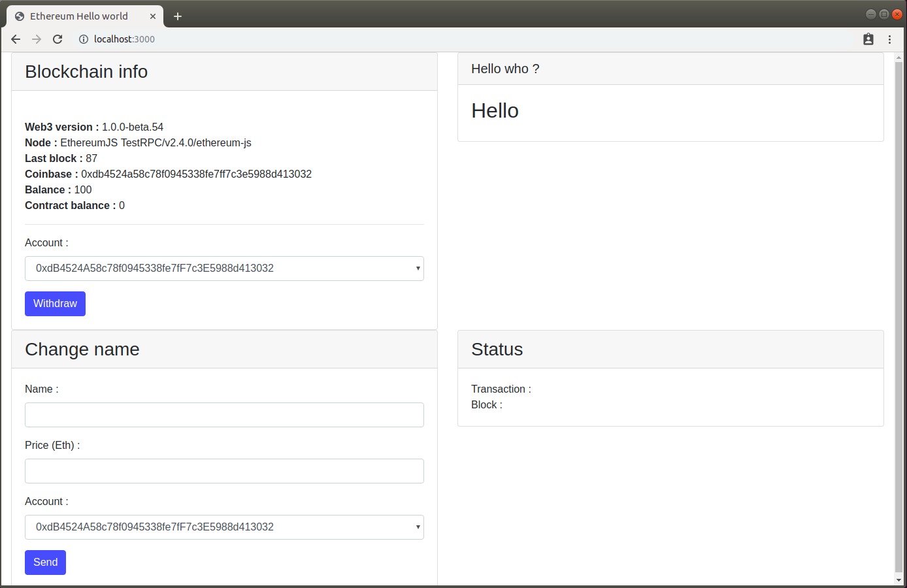

# Comment développer une application Ethereum ?

Dans ce tutoriel, nous allons voir comment développer une application couplée à la blockchain Ethereum.

Mise à jour : 06/05/2019

## Introduction

Ethereum permet la création de **smart contracts**. Ce sont des programmes qui sont envoyés à tous les noeuds du réseau et dont on active des fonctionnalités au moyen de transactions.
Ils vont donc s'exécuter sur tous les noeuds dès que ces derniers recevront la transaction correspondante.

Les smart contracts sont écrits en **Solidity**, un langage créé pour Ethereum. Ils sont exécutés dans l'**EVM (Ethereum Virtual Machine)**. C'est une **machine virtuelle à pile d'exécution** présente sur chaque noeud Ethereum. C'est à dire que le programme est décompoé en une suite d'instructions de base, placées sur une pile, et exécutées dans l'ordre de dépilage.

La documentation officielle du langage est disponible ici : 
https://solidity.readthedocs.io/en/latest/

Il est ensuite possible de connecter une application traditionnelle à un smart contract.

## Mise en garde

Il faut garder à l'esprit que l'état de l'environnement d'exécution peut varier d'un noeud à l'autre. Par exemple, selon qu'un autre transaction ait déjà été reçu ou pas encore par tel ou tel noeud. La conception des smart contracts ne doit donc pas être dépendante de l'environnement.

Ensuite, comme tout élément stocké sur la blockchain, une fois validés, ils sont immuables. C'est à dire qu'il est impossible de mettre à jour ou supprimer un smart contract. D'où l'importance de mettre l'accent sur la qualité lors des développement.

Une mise à jour de smart contract équivaut au déploiement d'un nouveau smart contract. L'ancien restera toujours présent, avec ses données. Il pourra cependant être désactivé, mais ne sera jamais complètement supprimé.

## DApp ?

Une DApp, ou **Decentralized Application**, application décentralisée, est une application déployée sur un réseau de façon uniforme et partagée, qui ne possède aucun élément central et nécessaire à son fonctionnement.

Une application reposant uniquement sur des smart contracts déployés sur une blockchain est donc une DApp. La coupler à une application NodeJS ou autre, déployée sur un serveur, hors de la blockchain, revient à créer un Single Point Of Failure. De ce fait, il ne s'agit plus réellement d'une DApp.


## Vous avez dit asynchrone ?

Un des concepts important du développement d'application connectée à une blockchain est le concetp d'asynchronicité.
En effet, l'envoi de donneés à une blockchain se fait au moyen de transactions. Ces transactions, en plus d'entrainer des coûts d'utilisation, sont asynchrones.

Lorsqu'une transaction est envoyée, elle doit être validée par un des noeuds de la blockchain, ce qui peut prendre un temps variable.
Dans certains cas, il faut également attendre une confirmation afin d'être (presque) certain qu'elle ne sera pas remise en question par une chaine plus longue qui ne la prendrait pas en compte.

L'obtention du résultat, ou le simple fait de considérer une modification comme effective, doit se faire dans ces conditions.

Dans notre projet en Node.js, cet asynchronicité sera mise en place au moyen de promesses. Les mots clés _Promise_, _async_, _await_ seront donc largement de la partie :)

## Description du projet

Dans ce projet, nous allons créer un simple HelloWorld.

Dans un premier temps, il se composera d'un simple smart contract, contenant une propriété, le nom de la personne à saluer, aisni que deux fonctions permettant de mettre à jour ce nom et de le récupérer.
Ensuite, nous créerons une applications Node.js qui affichera ce nom et proposera un formulaire pour le mettre à jour. Ces deux éléments seront liés aux fonctions du smart contract.

Dans un seconds temps, nous transformerons notre HelloWorld en service payant. La mise à jour du nom impliquera le paiement d'un certain tarif.
Le propriétaire du smart contract pourra alors récupérer quand il le souhaite l'intégralité des sommes que les utilisateurs auront payées.

Techniquement, nous aborderons la création, le test et le déploiement d'un smart contract. Puis la connection d'un application Node.js à un smart contract et l'envoi de transactions à celui-ci.


## Environnement

L'environnement d'exécution de ce tutorial se fera sous Linux, mais il est possible de trouver l'équivalent de chaque commande sous Windows ou Mac.

Ce tutorial sera basé sur Node.js. Il s'agit simplement de la technologie la plus répandue pour travailler avec les smart contracts, celle pour laquelle on trouve le plus d'outils et de frameworks disponibles.
Mais il est possible de trouver également des frameworks Java, Python ... qui fonctionnent de la même façon.

Nous allons dans un premier temps installer un certain nombre d'outils :

- Node.js : car le projet sera développé en Node.js :)

- Ganache : une blockchain de test, qui s'exécute en local et fournit une interface visuelle pour voir ce qu'il s'y passe.

https://truffleframework.com/ganache

- Truffle : un outil permettant de compiler, tester et déployer des smart contracts sur une blockchain.

https://truffleframework.com/truffle

- Web3.js : un framework javascript permettant d'interagir avec une blockchain.

https://web3js.readthedocs.io/en/1.0/index.html

Web3.js existe en version 0.20.X, qui est la version stable actuelle, et en version 1.0.X qui est encore en beta.
La version 0.20 permet une utilisation directement intégrée à des pages web, dans un navigateur. Elle est plus simple d'utilisation, mais sera prochainement dépréciée.
La version 1.0.X, bien que beta, a un bon niveau de stabilité et est bien plus complète. Cependant, elle impose un fonctionnement côté serveur, tel que Node.js.

Nous allons utiliser la version 1.0 pour ce tutorial.


```npm install ethereumjs-tx```

***

**Vous êtes prêts ? Alors allons-y !**

***
**Sommaire**
1. [Initialisation du projet](#1)
2. [Premier smart contract](#2)
3. [Test du smart contract](#3)
4. [Déploiement du smart contract](#4)
5. [Initialisation de l'application web](#5)
6. [Modification de la valeur](#6)
7. [Rendre la modification payante](#7)
8. [Administrer le contract](#8)
9. [Envoyer une transaction signée](#9)
10. [Les événements](#10)
11. [Ajouter un oracle](#11)
12. [Tests automatiques](#12)
13. [Focus sur l'utilisation du gas](#13)
14. [Sécurité](#14)
15. [Ressources](#15)

***

## 1. Initialisation du projet<a name="1"></a>

Dans un terminal, positionnez vous dans votre répertoire de travail, et lancez la commande suivante :

 ```truffle init```
 
Après une courte phase de téléchargement et d'initialisation, nous voyons apparaitre 3 répertoires et 1 fichier :
 
```contracts``` : code des smart contracts

```migrations``` : scripts permettant à Truffle de gérer les déploiements

```tests``` : scripts de tests unitaires des smart contracts

```truffle-config.js``` : fichier de configuration de Truffle

Dans certains de ces répertoires, des fichiers ```*migration*``` on été créés. Ils sont nécessaires à Truffle pour les déploiements de contrats, il ne faut pas les supprimer.

## 2. Premier smart contract<a name="2"></a>

Dans ```contracts```, créer un fichier Hello.sol. Y saisir le code suivant :

```
pragma solidity ^0.5.0;

contract Hello {

    string private name;

    constructor() public {
        name = "nobody";
    }

    function setName(string memory newName) public {
        name = newName;
    }

    function getName() public view returns (string memory) {
        return name;
    }
}

```

Etudions ce que nous venons d'écrire.

```pragma solidity ^0.5.0;``` décrit la version du compilateur que nous utilisons. Solidity est encore un langage qui évolue beaucoup et pour lequel il risque d'y avoir beaucoup d'incompatibilités entre les versions tant qu'il ne sera pas complètement stabilisé. Pouvoir choisir une version de compilateur permet donc de ne pas avoir à mettre à jour son code trop souvent. (Il est tout de même conseillé de le faire régulièrement pour bénéficier des améliorations de sécurité.)

Ensuite nous déclarons le contrat en indiquant son nom et en lui créant un champ privé de type chaine de caractères.

Ce contrat possède un constructeur, qui initialise son champ avec la valeur "nobody", ainsi qu'un getter et un setter pour modifier et accéder à ce champ.

Notez l'utilisation de certains mots clés :

```memory``` : indique que la valeur de cette variable (```newName```) est stockée en mémoire uniquement et non dans la blockchain. Elle n'occasionnera donc aucun coût de stockage, contrairement au champ ```name```.

```view``` : indique que cette fonction ne modifie pas l'état de la blockchain car elle ne fait que retourner une valeur. Elle n'occasionnera elle non plus aucun coût et peut donc être appelée gratuitement, contrairement à ```setName```, dont l'appel devra se faire via une transaction payante.

```returns (string memory)``` : indique le type de retour de la fonction. Là encore, il faut préciser que la donnée retournée ne transitera que par la mémoire et non par le stockage sur la blockchain.

Maintenant, tapez la commande suivante :

```truffle compile```

Si la compilation se termine avec succès, un répertoire ```build/contracts``` vient d'être créé. Il contient les résultats de la compilation. C'est dans ce répertoire que nous trouverons les **ABI** (Application Binary Interface). Il s'agit des contrats de service, définis en json, que notre application aura besoin de connaitre pour pouvoir interagir avec le smart contract. Nous verrons cela par la suite.


## 3. Test du smart contract<a name="3"></a>

Avant de déployer notre smart contract, nous allons le tester en utilisant Remix. C'est un IDE en ligne qui remplit à peu près le même rôle que Truffle. C'est l'occasion de tester un nouvel outil :).

https://remix.ethereum.org


## 4. Déploiement du smart contract<a name="4"></a>

Tout d'abord, lancez Ganache (ou tout autre client Ethereum).

Nous allons modifier le fichier ```truffle-config.js``` pour indiquer à Truffle les paramètres de connexion :

```
module.exports = {
  networks: {
    ganache: {
      host: "127.0.0.1",
      port: 7545,
      network_id: "*" // Match any network id
    }
  }
};
```

Nous indiquons qu'il existe un réseau, que nous nommons **ganache**, et qui disponible sur 127.0.0.1:7545 (IP/Port par défaut de Ganache, adaptez au besoin).
Il est possible de définir plusieurs réseaux, et de préciser dans la ligne de commande lequel utiliser. Le premier sera utilisé par défaut si rien n'est indiqué.

Dans le répertoire ```migrations``` dupliquez le fichier ```1_initial_migration.js``` en le nommant ```2_hello_migration.js```. Modifiez le contenu de ce nouveau fichier de cette façon :

```
const Hello = artifacts.require("Hello");

module.exports = function(deployer) {
  deployer.deploy(Hello);
};
```

Le paramètre du ```require``` doit être le nom du contrat tel que défini dans le fichier Hello.sol.


Maintenant, tapez la commande suivante :

```truffle deploy```

Vous devez obtenir le résultat suivant :



Vous obtenez différentes informations sur la transaction qui a déployé le contrat (numéro de transaction, prix ...).
Notez bien pour plus tard l'information la plus importante, l'adresse à laquelle le smart contract a été déployé ("contract address").

## 5. Initialisation de l'application web<a name="5"></a>

### 1.1 Création des fichiers

Nous allons initialiser une application web, basée sur Node.js, utilisant les framework Express pour MVC et Pug pour les templates HTML.
Dans un premier temps, nous allons créer une simple page d'index qui affiche des informations sur le noeud de blockchain auquel nous sommes connectés.

Nous allons créer plusieurs répertoires et fichiers :
- ```src/``` : pour contenir les sources de notre application web
- ```src/views``` : pour les templates des écrans
- ```src/views/index.pug``` : le template de l'index
- ```src/app.js``` : le contrôleur de l'application
- ```src/payablehello.js``` : les services de connexion à la blockchain
- ```src/config.js``` : la configuration de notre application

Placez-vous dans le répertoire ```src``` et initialisez le projet Node.js avec la commande

```npm init```

Saisissez les quelques informations demandées pour initialiser le projet.

Nous allons maintenant installer les packages nécessaires.

```npm install pug```

```npm install express```

```npm install web```

1ère étape, se connecter à la blockchain au moyen de web3.

**_config.js :_**

```javascript
const config = {

	// blockchain node IPC IP and port
	nodeURL: "http://127.0.0.1",
	nodePort: 7545,

	// default account address
	account:"0x1234567890abcdef......",

	// ABI file of smart contract
	abiFile:"../build/contracts/PayableHello.json",
	
	// address of deployed contract on blockchain
	payableHelloContractAddress:"0x1234567890abcdef......"	

};

module.exports = config;
```

Initialiser les valeurs 
- ```nodeURL``` et ```nodePort``` : éléments de connexion à Ganache
- ```account``` : adresse Ethereum du premier compte disponible sur Ganache.
- ```abiFile``` : chemin du fichier PayableHello.json dans le répertoire ```build``` généré par Truffle.
- ```payableHelloContractAddress``` : adresse à laquelle le contrat a été déployé avec Truffle. ("contract address" dans le résultat de ```truffle deploy```)


### 1.2 Connection à la blockchain

**_payablehello.js :_**

```
var Web3 = require("web3");
var fs = require('fs');
var config = require("./config.js");

var exports = module.exports = {};

var payableHello = null; // contract methods
var web3 = null;

/*
* Connect to blockchain
*/
exports.connection = function() {

	const options = {
		defaultAccount: config.account
	}

	web3 = new Web3(Web3.givenProvider || config.nodeURL+':'+config.nodePort, null, options);
	console.log("Connected to "+config.nodeURL+':'+config.nodePort);
}

/*
* Get connection info
*/
exports.getNodeInfo = async function() {

	var nodeInfo = {
		web3Version:  web3.version
	};

	// get all blockchain info from current node
	nodeInfo.blockNumber = await web3.eth.getBlockNumber();
	nodeInfo.coinbase = await web3.eth.getCoinbase();
	nodeInfo.node = await web3.eth.getNodeInfo();
	nodeInfo.balance = web3.utils.fromWei(await web3.eth.getBalance(config.account), 'ether');
	nodeInfo.contractBalance = web3.utils.fromWei(await web3.eth.getBalance(config.payableHelloContractAddress), 'ether');

	return nodeInfo;

}
```

### 1.3 Connection au contrat

Nous allons maintenant nous connecter au contrat :

**_payablehello.js :_**

```
/*
* Load contract's methods with ABI
*/
exports.initContracts = function() {

	// read ABI from file
	var parsed = JSON.parse(fs.readFileSync(config.abiFile));
	var payableHelloWorldABI = parsed.abi;

	// load contracts methods at contract address, using ABI
	payableHello = new web3.eth.Contract(payableHelloWorldABI, config.payableHelloContractAddress);

}
```

Cette fonction récupère l'objet javascript ABI dans le fichier json et le passe en paramètre, avec l'adresse du smart contract déployé, à la méthode ```web3.eth.Contract```, qui va retourner un object javascript permettant d'interagir avec le smart contract.

L'objet ```payableHello``` sera donc notre objet d'accès au contrat.

Nous pouvons initialiser notre template (on intègre Bootstrap pour faciliter la mise en forme) :

**_index.pug :_**
```
doctype html
html(lang='fr')
	head
		meta(charset='utf-8')
		title Ethereum Hello world
		script(type='text/javascript', src='https://code.jquery.com/jquery-3.3.1.slim.min.js')
		script(type='text/javascript', src='https://cdnjs.cloudflare.com/ajax/libs/popper.js/1.14.3/umd/popper.min.js')
		script(type='text/javascript', src='https://stackpath.bootstrapcdn.com/bootstrap/4.1.3/js/bootstrap.min.js')
		link(rel='stylesheet' href='https://stackpath.bootstrapcdn.com/bootstrap/4.1.3/css/bootstrap.min.css')
	body
	.container-fluid
		.row
			.col-md-6
				div.card
					h3.card-header Blockchain info
					div.card-body
						#info
							br
							div
								b Web3 version :&nbsp;
								span#web3-version #{nodeInfo.web3Version}
							div
								b Node :&nbsp;
								span#node #{nodeInfo.node}
							div
								b Last block :&nbsp;
								span#block-number #{nodeInfo.blockNumber}
							div
								b Coinbase :&nbsp;
								span#coinbase #{nodeInfo.coinbase}
							div
								b Balance :&nbsp;
								span#balance #{nodeInfo.balance}
							div
								b Contract balance :&nbsp;
								span#contract-balance #{nodeInfo.contractBalance}
```

Et pour lier tout ça, notre contrôleur, **_app.js :_**

```
var http = require('http');
var express = require('express');
var bodyParser = require('body-parser');
var stringify = require('json-stringify-safe');
var config = require("./config.js");
var payableHello = require('./payablehello'); // app services

var app = express();
app.set('view engine', 'pug');
app.use(bodyParser.urlencoded({ extended: false }))


// object containing data to display on index page
var displayData = {};
displayData.nodeInfo = null;
displayData.name = null;
displayData.txStatus = null;
displayData.blockNumber = null;
displayData.withdrawStatus = null;
displayData.nameHistory = null;
displayData.paymentHistory = null;
displayData.withdrawHistory = null;
displayData.errorMessage = null;
displayData.accounts = config.accounts;


/*
* 
*/
async function renderIndex(res) {

	try {
		// get blockchain node's information
		displayData.nodeInfo = await payableHello.getNodeInfo();
	}
	catch(error) {
		console.error(error);
	}

	res.render('index', displayData);
}

/*
* Display home page
*/
app.get('/', async function(req, res) {
	renderIndex(res);
});


// init blockchain connection
payableHello.connection();
payableHello.initContracts();

// start server
app.listen(3000);

```

On définit une route GET "/", qui affichera l'index, puis on appelle les méthodes définies précédemment pour se connecter à la blockchain et au contrat. Enfin, on lance l'application sur le port 3000 de localhost.

Nous avons maintenant tout ce qu'il faut pour lancer la première version de notre application, qui va :
- se connecter à la blockchain
- se connecter au smart contract
- afficher un certain nombre d'informations concernant le noeud de blockchain utilisé

Pour lancer l'application :

```node app.js```

Dans le navigateur ```http://localhost:3000```



Dans la partie "Blockchain info", nous pouvons voir que la valeur de la balance du compte utilisé, qui était à 100 ETH lors du lancement de Ganache, a été diminuée en fonction du coût des transactions qui ont permis de déployer les contrats.

### 1.4 Lecture d'une donnée

Nous allons maintenant enrichir tout ça en récupérant le nom de la personne à saluer et en l'affichant à l'écran.

**_payablehello.js :_**

```
/**
* Read the name from smart contract
*/
exports.readName = async function() {
	return payableHello.methods.getName().call({from: config.account});
}
```
On utilise l'objet ```payableHello``` défini précédement pour accéder aux méthodes du smart contact (```payableHello.methods```) et plus précisément à ```getName()```.
On termine l'instruction avec ```call()```, qui prend en paramètre les éléments pour effectuer une transaction. Ici, nous appelons une méthode qui est définie comme ```view``` dans le contrat, donc qui n'engendre pas de coût. Le seul paramètre que nous allons passer est l'adresse du compte qui va émettre cette transaction.

**_app.js :_**

On modifie la fonction renderIndex :

```
async function renderIndex(res) {

	try {
		displayData.nodeInfo = await payableHello.getNodeInfo();
		displayData.name = await payableHello.readName();
	}
	catch(error) {
		console.error(error);
	}

	res.render('index', displayData);
}
```
On y ajoute l'appel à notre fonction ```readName()```, pour initialiser la donnée à afficher.


**_index.pug_**:

On rajoute à la fin de notre template quelques lignes pour afficher le nom.


```
doctype html
html(lang='fr')
	head
		meta(charset='utf-8')
		title Ethereum Hello world
		script(type='text/javascript', src='https://code.jquery.com/jquery-3.3.1.slim.min.js')
		script(type='text/javascript', src='https://cdnjs.cloudflare.com/ajax/libs/popper.js/1.14.3/umd/popper.min.js')
		script(type='text/javascript', src='https://stackpath.bootstrapcdn.com/bootstrap/4.1.3/js/bootstrap.min.js')
		link(rel='stylesheet' href='https://stackpath.bootstrapcdn.com/bootstrap/4.1.3/css/bootstrap.min.css')
	body
	.container-fluid
		.row
			.col-md-6
				div.card
					h3.card-header Blockchain info
					div.card-body
						#info
							br
							div
								b Web3 version :&nbsp;
								span#web3-version #{nodeInfo.web3Version}
							div
								b Node :&nbsp;
								span#node #{nodeInfo.node}
							div
								b Last block :&nbsp;
								span#block-number #{nodeInfo.blockNumber}
							div
								b Coinbase :&nbsp;
								span#coinbase #{nodeInfo.coinbase}
							div
								b Balance :&nbsp;
								span#balance #{nodeInfo.balance}
							div
								b Contract balance :&nbsp;
								span#contract-balance #{nodeInfo.contractBalance}
			.col-md-6
				div.card
					h5.card-header Hello who ?
					div.card-body
						h2 Hello #{name}
```

Dans le navigateur :


Le nom s'affiche. Du moins, la valeur par défaut définie dans le constructeur.

## 6. Modification de la valeur<a name="6"></a>

Nous allons maintenant pouvoir chercher à modifier le nom.

**_payablehello.js :_**

Commençons par créer le service

```
/*
* Call change name function and wait for event
* newName : the new name to set
*/
exports.updateName = async function(newName) {

	// object containing return values
	var result = new Object();

	// estimate gas cost
	var gasAmount = await payableHello.methods.setName(newName).estimateGas({from: config.account, gas: 5000000});
	
	result.gas = gasAmount;

	var promiseSetName = new Promise( function (resolve, reject){

		// send a transaction to setName
		payableHello.methods.setName(newName).send({from: config.account, gas: gasAmount})
		.on('transactionHash', (hash) => {
				// when tx hash is known
			   result.txHash = hash;
		   })
		   .on('receipt', (receipt) => {
		   		// when receipt is created
			   console.log("receipt");
		   })
		   .on('confirmation', (confirmationNumber, receipt) => {
		   		// when tx is confirmed
			   result.blockNumber = receipt.blockNumber;
			   resolve(result);
		   })
		   .on('error',(error) => {
				reject(error);
		   });
	}); // end of promiseSetName, result to return

	return promiseSetName;
}
```

On créer une méthode _updateName_ qui prend en paramètre le nouveau nom. Ensuite, le traitement va s'effectuer en plusieurs étapes : 

1. Nous allons appeler une méthode du smart contract qui modifie la blockchain, cette transaction va donc entrainer un coût d'utilisation. Ce coût s'exprime en _gaz_, le carburant d'Ethereum.
Dans un premier temps, il faut estimer la quantité de gaz nécessaire au moyen de ```estimateGas()```.

2. Puis nous pouvons appeler la méthode ```setName()``` en lui indiquant d'utiliser cette quantité de gaz. Il est possible de passer directement une grande quantité de gaz, mais au risque de la voir entièrement consommée si la transaction d'avère trop grosse, et donc qu'elle nous coûte très cher. A l'inverse, si la quantité de gaz fournie est trop faible, le gaz sera consommé, mais la transaction ne sera pas validée.
Le traitement d'une transaction étant asynchrone, nous récupérons une Promise, que nous allons retourner.

3. Ensuite, il faut attendre que la transaction soit prise en compte. Pour celà, nous allons utiliser plusieurs événements, qui se produisent à différents moment de la vie de la transaction :
- ```transactionHash``` : quand la transaction obtient un hash et est envoyée au réseau.
- ```receipt``` : quand le reçu de transaction est créé, on y trouve la majeur partie des informations concernant cette transaction.
- ```confirmtion``` : quand la transaction est confirmée (c'est à dire quand un certain nombre de blocs ont été minés à la suite de celui qui la contient, ce nombre peut être déterminé dans les options de connexion à la blockchain).
- ```error``` : en cas d'erreur

**_index.pug :_** 

Puis modifions notre template : 

```
doctype html
html(lang='fr')
	head
		meta(charset='utf-8')
		title Ethereum Hello world
		script(type='text/javascript', src='https://code.jquery.com/jquery-3.3.1.slim.min.js')
		script(type='text/javascript', src='https://cdnjs.cloudflare.com/ajax/libs/popper.js/1.14.3/umd/popper.min.js')
		script(type='text/javascript', src='https://stackpath.bootstrapcdn.com/bootstrap/4.1.3/js/bootstrap.min.js')
		link(rel='stylesheet' href='https://stackpath.bootstrapcdn.com/bootstrap/4.1.3/css/bootstrap.min.css')
	body
	.container-fluid
		.row
			.col-md-6
				div.card
					h3.card-header Blockchain info
					div.card-body
						#info
							br
							div
								b Web3 version :&nbsp;
								span#web3-version #{nodeInfo.web3Version}
							div
								b Node :&nbsp;
								span#node #{nodeInfo.node}
							div
								b Last block :&nbsp;
								span#block-number #{nodeInfo.blockNumber}
							div
								b Coinbase :&nbsp;
								span#coinbase #{nodeInfo.coinbase}
							div
								b Balance :&nbsp;
								span#balance #{nodeInfo.balance}
							div
								b Contract balance :&nbsp;
								span#contract-balance #{nodeInfo.contractBalance}
			.col-md-6
				div.card
					h5.card-header Hello who ?
					div.card-body
						h2 Hello #{name}
		.row
			.col-md-6
				div.card
					h3.card-header Change name
					div.card-body
						#form
							form(method='post', action='/name')
								.form-group
									label(for='newName') Name :
									input#newName(type='text', name='newName').form-control
								div
									input(type='submit', value='Send').btn.btn-primary
			.col-md-6
				div.card
					h3.card-header Status
					div.card-body
						div#status Transaction : #{txStatus}
						div#blockNumber Block : #{blockNumber}
						div#errorMessage #{errorMessage}
```

On y ajoute un formulaire pour saisir le nouveau nom, ainsi qu'un bloc qui va afficher le résultat de la modification.


**_app.js :_**

Le formulaire effectue un POST sur ```/name```. Nous allons donc aussi modifier le contrôleur pour créer une route qui appelle le service créé précédemment.

```
/**
* Update name
*/
app.post('/name', function(req, res) {

	// execute the selected promise
	try {
		payableHello.updateName(req.body.newName)
		.then(
			(result) => {
				displayData.txStatus = result.txHash;
				displayData.blockNumber = result.blockNumber;
				displayData.errorMessage = result.errorMessage;
				res.redirect("/");
			},
			(error) => {
            	displayData.errorMessage = error;
				res.redirect("/");
			}
		);
	}
	catch(error){
		displayData.errorMessage = error;
		res.redirect("/");
	}
});
```

Nous pouvons afficher le résultat dans le navigateur :


Entrez le nom de votre choix, et cliquez sur "Send".



Dans le bloc "Status", nous récupérons le numéro de la transaction qui a modifié le nom et le numéro du bloc dans lequel elle a été validée.

Il est possible de récupérer en grand nombre d'informations sur la transaction. Pour celà, vous pouvez inspecter l'objet ```receipt``` obtenu lors de l'envoi de la transaction.

On peut également aller tester le smart contract avec Remix. On constatera que la valeur du nom est bien celle que nous avons envoyée.
On peut aussi consulter la liste des transactions dans Ganache pour retrouver celle que nous avons envoyée.

Dans la partie "Blockchain info", nous pouvons aussi voir que la valeur de la balance du compte utilisé diminue en fonction du coût de la transaction.


## 7. Rendre la modification payante<a name="7"></a>

Prochaine étape, nous allons maintenant rendre la modification du nom payante. Pour celà, nous allons mettre en place un certain nombre de conditions :
- La modification du nom coûte 2 ETH, mais il est possible de payer plus.
- Il ne doit pas être possible d'envoyer d'Ethers au smart contract sans modifier le nom.

**_PayableHello.sol :_**

Tout d'abord, on modifie le contrat : 

```
pragma solidity ^0.5.0;

contract PayableHello {

    string private name;

    constructor() public {
        name = "nobody";
    }

    function setName(string memory newName) public payable {
		require(msg.value >= 2 ether, "Pay 2 ETH or more");
        name = newName;
    }

    function getName() public view returns (string memory) {
        return name;
    }
    
    function() external payable {
        revert();
    }
        
}
```

On ajoute une condition dans la méthode ```setName```, afin d'indiquer que son exécution requiert au minimum un envoi de 2 ETH dans la transaction.
Via la fonction ```require()```, nous indiquons la condition à respecter et le message à retourner en cas de non respect.
Nous introduisons ici la variable globale ```msg```, qui contient les données relative à la transaction courante. On peut y touver l'adresse de l'émetteur (```sender```), le nombre d'Ethers envoyés (```value```) ...

Notez également l'ajout du mot clé ```payable``` dans la définition de la méthode. Il indique qu'elle pourra être appelée par des transactions qui envoient des Ethers. 
Envoyer des Ethers à une méthode qui n'est pas ```payable``` échouera.

Nous avons aussi ajouté ce que l'on appelle la fonction de fallback :

```
    function() external payable {
        revert();
    }
```

Cette fonction, sans nom, est automatiquement appelée lorsque le contrat reçoit une transaction avec des Ethers, sans appel de méthode spécifiquement.
Ici, nous exécutons simplement ```revert()``` pour indiquer que la transaction doit être annulée si nous sommes dans ce cas.

Cette fonction fallback est définie elle aussi comme ```payable```, mais également comme ```external```, c'est à dire qu'elle ne peut être appelée que depuis l'extérieur, et non par des méthodes du contrat.


**_payablehello.js:_**

Modifions le service afin de prendre en compte cette valeur :

```
/*
* Call change name function and wait for event
* newName : the new name to set
* price : the number of ethers we pay to change the name
*/
exports.updateName = async function(newName, price) {

	// object containing return values
	var result = new Object();

	// estimate gas cost
	var gasAmount = await payableHello.methods.setName(newName).estimateGas({from: config.account, gas: 5000000, value: web3.utils.toWei(price, "ether")});
	result.gas = gasAmount;

	var promiseSetName = new Promise( function (resolve, reject){

		// send a transaction to setName
		payableHello.methods.setName(newName).send({from: config.account, gas: gasAmount, value: web3.utils.toWei(price, "ether")})
		.on('transactionHash', (hash) => {
				// when tx hash is known
			   result.txHash = hash;
		   })
		   .on('receipt', (receipt) => {
		   		// when receipt is created
			   console.log("receipt");
		   })
		   .on('confirmation', (confirmationNumber, receipt) => {
		   		// when tx is confirmed
			   result.blockNumber = receipt.blockNumber;
			   resolve(result);
		   })
		   .on('error',(error) => {
				reject(error);
		   });
	}); // end of promiseSetName, result to return

	return promiseSetName;
}

```
On ajoute un paramètre ```price``` à la méthode ```updateName```.
On utilise ce paramètre pour alimenter un nouveau paramètres ```value``` lors des appels à ```estimateGas``` et ```setName```.
Lors de ces appels, il faut passer une valeur en Wei, or nous l'avons en Ethers. Il faut donc la convertir grâce à ```web3.utils.toWei(price, "ether")``` qui prend en premier paramètre une valeur et en second paramètre l'unité de cette valeur.


**_index.pug :_**

Nous ajoutons maintenant au template un champ dans le formulaire de modification de nom, afin que l'utilisateur saisisse le prix qu'il souhaite payer.

```
doctype html
html(lang='fr')
	head
		meta(charset='utf-8')
		title Ethereum Hello world
		script(type='text/javascript', src='https://code.jquery.com/jquery-3.3.1.slim.min.js')
		script(type='text/javascript', src='https://cdnjs.cloudflare.com/ajax/libs/popper.js/1.14.3/umd/popper.min.js')
		script(type='text/javascript', src='https://stackpath.bootstrapcdn.com/bootstrap/4.1.3/js/bootstrap.min.js')
		link(rel='stylesheet' href='https://stackpath.bootstrapcdn.com/bootstrap/4.1.3/css/bootstrap.min.css')
	body
	.container-fluid
		.row
			.col-md-6
				div.card
					h3.card-header Blockchain info
					div.card-body
						#info
							br
							div
								b Web3 version :&nbsp;
								span#web3-version #{nodeInfo.web3Version}
							div
								b Node :&nbsp;
								span#node #{nodeInfo.node}
							div
								b Last block :&nbsp;
								span#block-number #{nodeInfo.blockNumber}
							div
								b Coinbase :&nbsp;
								span#coinbase #{nodeInfo.coinbase}
							div
								b Balance :&nbsp;
								span#balance #{nodeInfo.balance}
							div
								b Contract balance :&nbsp;
								span#contract-balance #{nodeInfo.contractBalance}
			.col-md-6
				div.card
					h5.card-header Hello who ?
					div.card-body
						h2 Hello #{name}
		.row
			.col-md-6
				div.card
					h3.card-header Change name
					div.card-body
						#form
							form(method='post', action='/name')
								.form-group
									label(for='newName') Name :
									input#newName(type='text', name='newName').form-control
								.form-group
									label(for='price') Price (Eth) :
									input#price(type='text', name='price').form-control
								div
									input(type='submit', value='Send').btn.btn-primary
			.col-md-6
				div.card
					h3.card-header Status
					div.card-body
						div#status Transaction : #{txStatus}
						div#blockNumber Block : #{blockNumber}
						div#errorMessage #{errorMessage}


```

**_app.js :_**

Il ne reste plus qu'à modifier le contrôleur afin de prendre en compte ce nouvelle valeur transmise par le champ de formulaire.

```
/**
   * Update name
   */
   app.post('/name', function(req, res) {
   
   	// execute the selected promise
   	try {
   		payableHello.updateName(req.body.newName, req.body.price)
   		.then(
   			(result) => {
   				displayData.txStatus = result.txHash;
   				displayData.blockNumber = result.blockNumber;
   				displayData.errorMessage = result.errorMessage;
   				res.redirect("/");
   			},
   			(error) => {
               	displayData.errorMessage = error;
   				res.redirect("/");
   			}
   		);
   	}
   	catch(error){
   		displayData.errorMessage = error;
   		res.redirect("/");
   	}
   });
```

On récupère la valeur du champ ```price``` de la requête pour le transmettre en paramètre à ```updateName```.

Nous pouvons maintenant tester :



Tapez un nom, entrez une valeur supérieure ou égale à 2 dans le champ "price", et validez.
On peut constater que la balance du compte a été réduite du nombre d'Ether donné, plus un peu de gaz, et que la balance du contrat a, quant à elle, augmenté de cette même somme.
Celà signifie que pour le moment, c'est bien le smart contract qui possède les Ethers que nous lui avons envoyés.


Nous pouvons aussi essayer de changer de nom en en payant qu'un seul Ether : 



Nous obtenons une erreur, qui contient le message que nous avons passé en paramètre de ```require()``` dans le cas où la condition ne serait pas remplie.
Les balances du compte et du contrat n'ont pas bougés, donc les Ethers n'ont pas été transférés et le nom n'a pas changé, preuve que la transaction n'a pas été acceptée.
Cependant, la balance du compte a quand même perdu quelques Wei. En effet, même si une transaction est rejetée, le gas consommé pour la prendre en compte est bel et consommé pour de bon.


## 8. Administrer le contract<a name="8"></a>

Bien, maintenant que nous savons que le contrat possède des Ethers, il serait bien de pouvoir les récupérer, et si possible que ce ne soit possible que par son propriétaire.

Nous allons donc modifier le contrat pour :
- pouvoir récupérer les Ethers et les envoyer à une adresse
- faire en sorte que les Ethers ne puissent être envoyés qu'au propriétaire du contrat.

**_PayableHello.sol :_**

```
pragma solidity ^0.5.0;

contract owned {
	address payable owner;

	// Contract constructor: set owner
	constructor() public {
		owner = msg.sender;
	}

	// Access control modifier
	modifier onlyOwner {
	    require(msg.sender == owner, "Only the contract owner can call this function");
	    _;
	}

	// Contract destructor
	function destroy() public onlyOwner {
		selfdestruct(owner);
	}

}

contract PayableHello is owned {

    string private name;

    constructor() public {
        name = "nobody";
    }

    function setName(string memory newName) public payable {
    	require(msg.value >= 2 ether, "Pay 2 ETH or more");
        name = newName;
    }

    function getName() public view returns (string memory) {
        return name;
    }

    function withdraw() public onlyOwner {
    	uint balance = address(this).balance;
		msg.sender.transfer(balance);
    }

    function() external payable {
        revert();
    }

}
```

Nous allons introduire deux nouvelles notions : l'héritage et les modificateurs.

Nous créons un nouveau contrat ```owned``` qui contient :
- un champ privé ```owner``` qui contiendra l'adresse du propriétaire de ce contrat (notez que ce champ est ```payable```)
- un constructeur, qui initialise ```owner``` avec l'adresse qui a émit la transaction de création du contrat
- une méthode de type ```modifier``` appelée ```onlyOwner```. Il s'agit de définit un comportement, afin de créer un sorte de "mot-clé" que l'on réutilisera sur d'autres méthodes, pour lesquels ce comportement s'appliquera.
Ici, ce modificateur comporte une condition qui impose que l'utilisateur qui l'appelle soit le propriétaire du contrat, donc que son adresse soit celle qui a créé le contrat. 
Ensuite, on trouve ```_;``` qui signifie tout simplement "Exécuter ici le code défini dans la méthode qui utilise ce modificateur".
En gros, toute fonction qui se verra appliquer le modificateur ```onlyOwner``` exécutera la condition de propriété, puis exécutera ensuite son code propre.
- ue méthode ```destroy```, à laquelle le modificateur ```onlyOnwer``` est appliquée, qui exécute ```selfdestruct```. ```selfdestruct``` désactive le contrat et transfère sa balance à l'adresse qui l'appelle. Vous comprenez pourquoi il faut restreindre son accès au propriétaire, sinon n'importe qui pourrait tout casser et prendre l'argent.
A noter qu'un contrat qui a subit un ```selfdesctuct``` est désactivé, mais pas supprimé. Il ne peut plus exécuter ses méthodes, par contre, il sera toujours possible de lui envoyer des Ethers, qui seront alors perdus car il sera impossible de les récupérer.

Ensuite, nous modifions la définition du contrat PayableHello en ```contract PayableHello is owned ```. Cela signifie que ```PayableHello``` hérite de toutes les propriétés de ```owned```.
L'adresse de son propriétaire est donc enregistrée, il pourra être désactivé par lui uniquement. Le modificateur ```onlyOwner``` pourra aussi être appliqué à n'importe laquelle de ses méthodes.

D'ailleurs, nous ajoutons aussi une méthode ```withdraw``` qui utilise ce modificateur. Elle récupère l'adresse de l'émetteur de la transaction via ```msg.sender``` et lui envoie la balance via ```transfert```.

Une fois le contrat modifié, nous allons créer un service pour permettre au propriétaire de récupérer ses Ether :

**_payablehello.js :_**
```
/**
* Retreive contract balance. Only works for contract owner
* withdrawAccount : the address to send ethers to
*/
exports.withdraw = async function(withdrawAccount) {

	var result = new Object();

	// estimate gas cost
	var gasAmount = await payableHello.methods.withdraw().estimateGas({from: withdrawAccount, gas: 5000000});
	result.gas = gasAmount;

	var promiseWithdraw = new Promise( function (resolve, reject){

		// send tx to withdraw function
		payableHello.methods.withdraw().send({from: withdrawAccount, gas: gasAmount*2})
		.on('transactionHash', (hash) => {
			   result.txHash = hash;
		   })
		   .on('receipt', (receipt) => {
			   console.log("receipt");
		   })
		   .on('confirmation', (confirmationNumber, receipt) => {
			   result.blockNumber = receipt.blockNumber;
			   resolve(result);
		   })
		   .on('error',(error) => {
				result.errorMessage = error;
				reject(result);
		   });
	});

	return promiseWithdraw;
}
```

Nous lui ajoutons une méthode ```withdraw``` qui prend en paramètre l'adresse vers laquelle transférer la balance du contrat.
Sur le même modèle que pour modifier le nom, cette méthode va d'abord estimer le gaz nécessaire pour appeler la méthode ```withdraw``` du contrat depuis l'adresse passée en paramètre. Puis va effectivement réaliser l'appel.
Comme il s'agit également d'un envoi de transaction, nous allons ici aussi exploiter les différents événements disponibles pour récupérer les informations inhérentes à cette transaction.


Maintenant modifions la page pour ajouter cette fonctionnalité :

**_index.pug :_**

```
doctype html
html(lang='fr')
	head
		meta(charset='utf-8')
		title Ethereum Hello world
		script(type='text/javascript', src='https://code.jquery.com/jquery-3.3.1.slim.min.js')
		script(type='text/javascript', src='https://cdnjs.cloudflare.com/ajax/libs/popper.js/1.14.3/umd/popper.min.js')
		script(type='text/javascript', src='https://stackpath.bootstrapcdn.com/bootstrap/4.1.3/js/bootstrap.min.js')
		link(rel='stylesheet' href='https://stackpath.bootstrapcdn.com/bootstrap/4.1.3/css/bootstrap.min.css')
	body
	.container-fluid
		.row
			.col-md-6
				div.card
					h3.card-header Blockchain info
					div.card-body
						#info
							br
							div
								b Web3 version :&nbsp;
								span#web3-version #{nodeInfo.web3Version}
							div
								b Node :&nbsp;
								span#node #{nodeInfo.node}
							div
								b Last block :&nbsp;
								span#block-number #{nodeInfo.blockNumber}
							div
								b Coinbase :&nbsp;
								span#coinbase #{nodeInfo.coinbase}
							div
								b Balance :&nbsp;
								span#balance #{nodeInfo.balance}
							div
								b Contract balance :&nbsp;
								span#contract-balance #{nodeInfo.contractBalance}
							div
								form(method='post', action='/withdraw')
									div
										input(type='submit', value='Withdraw').btn.btn-primary
										span#withdraw-status
										
...
```

Dans le bloc "Blockchain info", nous ajoutons un formulaire qui ne contient qu'un seul bouton nommé "Withdraw", qui valide le formulaire vers l'URL ```withdraw```.
Nous allons donc maintenant modifier le contrôleur pour ajouter cette nouvelle route.

**_apps.js :_**

```
/**
* Withdraw contract balance
*/
app.post('/withdraw', function(req, res) {

	try {
		payableHello.withdraw(config.account)
		.then(
			(result) => {
				displayData.txStatus = result.txHash;
				displayData.blockNumber = result.blockNumber;
				displayData.errorMessage = result.errorMessage;
				res.redirect("/");
			},
			(error) => {
				displayData.errorMessage = error;
				res.redirect("/");
			}
		);
	}
	catch(error) {
		displayData.errorMessage = error;
		res.redirect("/");
	}
});
```

Nous appelons le service ```withdraw``` avec comme paramètre l'adresse par défaut de notre configuration, celle qui a bien servi à créer le contrat.

On peut maintenant tester :


Avant le retrait, le compte a une balance de 90 ETH environ, et le contrat, 7 ETH. Cliquez sur "withdraw".


Maintenant, la balance du contrat est revenue à 0, alors que le compte a récupéré 7 ETH supplémentaires.

Ca a donc fonctionné, parce que le compte que nous avons utilisé est bien le propriétaire du contrat.

Nous savons maintenant comment créer un service payant, et récupérer l'argent qu'il a généré.


## 9. Envoyer une transaction signée<a name="9"></a>

Pour le moment, il nous a été facile d'envoyer des transactions en utilisant un compte par défaut, que nous avons renseigné dans la configuration du projet. Nous avons émis en son nom un certain nombre de transactions, qui lui ont coûté des Ethers. Et pourtant, à aucun moment, il ne nous a été demandé de justifier que ce compte nous appartenait, en saisissant un mot de passe ou en fournissant une clé privée par exemple.
Ca a été possible parce que ce compte est enregistré dans le noeud de blockchain que nous utilisons, et que par défaut dans Ganache, les comptes sont déverouillés, c'est à dire, utilisables directement.

Avec un vrai noeud Ethereum, il aurait fallu enregistrer notre compte puis le déverrouiller en fournissant sa clé privée dans un keystore.

Maintenant, dans notre projet, nous allons élargir un peu les possibilités en termes d'utilisation de comptes en donnant la possibilité de créer des transactions signées, c'est-à-dire dont l'utilisateur fournit son adresse et sa clé privée. Notre projet sera ainsi accessible à tout compte, qu'il soit enregistré ou non dans notre noeud de Blockchain.

Attention : dans ce qui va suivre, nous allons manipuler des clés privées, qui sont le point sensible en matière de sécurité sur la blockchain. Nous allons le faire de façon simple, pour en apréhender le fonctionnement, mais dans un réel projet de production, il faudra mettre en place les politiques de sécurité adaptées pour les manipuler (HMS, keystore ...).

Voici ce que nous allons faire :
1. Ajouter des comptes et leurs clés privées dans la configuration (ce qui doit être bien plus sécurisé que ça dans la vraie vie)
2. Ajouter à l'écran un liste de choix du compte à utiliser
3. Pour chaque appel au smart contract, forger une transaction en fonction du compte sélectionné.

Pour créer d'autres comptes, vous pouvez afficher la liste des comptes de Ganache, et prendre tous les autres comptes autres que le premier. Les clés privées peut être obtenus en cliquant sur l'icône "clé", sur la droite de l'écran pour chaque compte.

**_config.js :_**
```
const config = {

	// blockchain node IPC IP and port
	nodeURL: "http://127.0.0.1",
	nodePort: 7545,

	// default account address
	account:"0xdB4524A58c78f0945338fe7fF7c3E5988d413032",

	// ABI file of smart contract
	abiFile:"../build/contracts/PayableHello.json",

	// address of deployed contract on blockchain
	payableHelloContractAddress:"0x31314b12bBC4b9F21B08565EEB5840aF6A1F8dfD",

	// all available accounts with their private key (except for first account, that is the default account)
	accounts: [
		{
			address: "0xdB4524A58c78f0945338fe7fF7c3E5988d413032",
			pk: null
		},
		{
			address: "0x4a4817F49F7f31a2c639C5C723D4BAA194AD0f77",
        	pk: "12cc2f60b68a8fefb85e93fed0a2ae4680a465f714e4ea42f4a73cf27f317257"
		},
		{
			address: "0xD04EabD4Ba1d8C655B3f95A24e89CaBbfFe0af33",
        	pk: "4b535457d08e576c956d693ef8f17cf07bfd364ed0de401c942537da92254a1f"
		}
	]

};

module.exports = config;
```

**_app.js :_**

On rajoute dans le contrôleur, à l'initialisation des données d'affichage, la liste des comptes.
```
displayData.accounts = config.accounts;
```

**_index.pug :_**

Et on modifie l'index pour afficher la liste des ces comptes au niveau du bouton de retrait de l'argent du contrat et de modification du nom.

```
doctype html
html(lang='fr')
	head
		meta(charset='utf-8')
		title Ethereum Hello world
		script(type='text/javascript', src='https://code.jquery.com/jquery-3.3.1.slim.min.js')
		script(type='text/javascript', src='https://cdnjs.cloudflare.com/ajax/libs/popper.js/1.14.3/umd/popper.min.js')
		script(type='text/javascript', src='https://stackpath.bootstrapcdn.com/bootstrap/4.1.3/js/bootstrap.min.js')
		link(rel='stylesheet' href='https://stackpath.bootstrapcdn.com/bootstrap/4.1.3/css/bootstrap.min.css')
	body
	.container-fluid
		.row
			.col-md-6
				div.card
					h3.card-header Blockchain info
					div.card-body
						#info
							br
							div
								b Web3 version :&nbsp;
								span#web3-version #{nodeInfo.web3Version}
							div
								b Node :&nbsp;
								span#node #{nodeInfo.node}
							div
								b Last block :&nbsp;
								span#block-number #{nodeInfo.blockNumber}
							div
								b Coinbase :&nbsp;
								span#coinbase #{nodeInfo.coinbase}
							div
								b Balance :&nbsp;
								span#balance #{nodeInfo.balance}
							div
								b Contract balance :&nbsp;
								span#contract-balance #{nodeInfo.contractBalance}
							hr
							div
								form(method='post', action='/withdraw')
									.form-group
										label(for='withdrawAccount') Account :
										select#withdrawAccount(name='withdrawAccount').form-control
											each account in accounts
												option(value=account.address) #{account.address}
									div
										input(type='submit', value='Withdraw').btn.btn-primary
										span#withdraw-status
			.col-md-6
				div.card
					h5.card-header Hello who ?
					div.card-body
						h2 Hello #{name}
		.row
			.col-md-6
				div.card
					h3.card-header Change name
					div.card-body
						#form
							form(method='post', action='/name')
								.form-group
									label(for='newName') Name :
									input#newName(type='text', name='newName').form-control
								.form-group
									label(for='price') Price (Eth) :
									input#price(type='text', name='price').form-control
								.form-group
									label(for='account') Account :
									select#account(name='account').form-control
										each account in accounts
											option(value=account.address) #{account.address}
								div
									input(type='submit', value='Send').btn.btn-primary
			.col-md-6
				div.card
					h3.card-header Status
					div.card-body
						div#status Transaction : #{txStatus}
						div#blockNumber Block : #{blockNumber}
						div#errorMessage #{errorMessage}
```

Voici le résultat à l'affichage :



Maintenant, nous allons exploiter tout ça.

**_app.js :_**

Dans le contrôleur, nous allons prendre en compte ce nouveau champ de formulaire, dans POST /name et dans POST /withdraw

```
/**
* Update name
*/
app.post('/name', function(req, res) {

	var promiseUpdateName;

	if(req.body.account === config.account) {
		// use default account activated on blockchain
		promiseUpdateName = payableHello.updateName(req.body.newName, req.body.price);
	}
	else {
		// use another account from default one, need to sign a raw transaction
		promiseUpdateName = payableHello.sendRawTransaction(req.body.newName, req.body.price, req.body.account);
	}

	// execute the selected promise
	try {
		promiseUpdateName
		.then(
			(result) => {
				displayData.txStatus = result.txHash;
				displayData.blockNumber = result.blockNumber;
				displayData.errorMessage = result.errorMessage;
				res.redirect("/");
			},
			(error) => {
            			displayData.errorMessage = error;
				res.redirect("/");
			}
		);
	}
	catch(error){
		displayData.errorMessage = error;
		res.redirect("/");
	}
});


/**
* Withdraw contract balance
*/
app.post('/withdraw', function(req, res) {

...
		payableHello.withdraw(req.body.withdrawAccount)
...
});


```

Dans le POST /name, nous ajoutons une condition pour continuer à utiliser les méthodes définies précédemment si c'est le compte par défaut qui a été sélectionné, ou un nouveau service ```sendRawTransaction``` pour envoyer une transaction signée si c'est un autre compte.

Maintenant, créons ce service ```sendRawTransaction``` :

**_payablehello.js :_**

```
...
var EthereumTx = require("ethereumjs-tx");
...

/**
* Update name using smart contract, using account different from default one
* newName : the new name to set
* price : the number of ethers we pay to change the name
* address : the address used to send tx
*/
exports.sendRawTransaction = async function(newName, price, address) {

	var result = new Object();
	var plainPrivateKey = null;

	// get privake key from config according for sender address
	config.accounts.forEach(function(element) {
		if(element.address === address){
			plainPrivateKey = element.pk;
		}
	});

	// get tx count for address
	var txCount = await web3.eth.getTransactionCount(address);

	// create tx
	var txParams = {
		from: address,
		nonce: web3.utils.toHex(txCount),
		gasPrice: web3.utils.toHex(web3.utils.toWei('20', 'gwei')),
		gasLimit: web3.utils.toHex(4000000),
		to: config.payableHelloContractAddress,
		value: web3.utils.toHex(web3.utils.toWei(price, "ether")),
		data: web3.utils.toHex(payableHello.methods.setName(newName).encodeABI())
	}

	// estimate tx gas cost
	var gasAmount = await web3.eth.estimateGas(txParams);
	result.gas = gasAmount;

	// update gas limit
	txParams.gasLimit = web3.utils.toHex(gasAmount);

	// create result promise that will be resolved when tx is confirmed
	var promiseSendRawTx = new Promise( function (resolve, reject){

		// create raw tx
		const tx = new EthereumTx(txParams);

		// encode pk in hex
		const privateKey = Buffer.from(plainPrivateKey, 'hex');

		// sign tx with private key
		tx.sign(privateKey)

		// serialize tx
		const serializedTx = tx.serialize();

		// send raw tx
		web3.eth.sendSignedTransaction('0x' + serializedTx.toString('hex'))
		.on('transactionHash', (hash) => {
			   result.txHash = hash;
		   })
		   .on('receipt', (receipt) => {
			   console.log("receipt");
		   })
		   .on('confirmation', (confirmationNumber, receipt) => {
			   result.blockNumber = receipt.blockNumber;
			   resolve(result);
		   })
		   .on('error',(error) => {
				reject(error);
		   });


	}); // end of promiseSendRawTx, to be returned

	return promiseSendRawTx;
}

```

Tout d'abord, il faut importer ```EthereumTx```, qui nous aidera à construire des transactions signées.


Décortiquons ce que fait ce service :
1. Dans un premier temps, s'il reçoit en paramètre une adresse différente du compte par défaut, il va récupérer sa clé privée dans la configuration. (Cette étape devrait être beaucoup plus sécurisée dans la vraie vie.)
2. Ensuite, il récupère le nombre de transactions que ce compte a déjà effectué, au moyen de ```web3.eth.getTransactionCount(address)```. Cette information sera à fournir en tant que nonce, pour éviter que la même transaction soit envoyée plusieurs fois.
3. Puis il crée un transaction en renseignant tous les champs individuellement. Chaque valeur doit être fournie en hexadécimal, on peut utiliser ```web3.utils.toHex``` pour faciliter la conversion. 
4. On estime ensuite la quantité de gaz nécessaire, que l'on vient mettre à jour dans la transaction précédemment créée.
5. Et enfin, au moyen du module ```EthereumTx```, on crée la transaction que l'on vient signer avec la clé privée. La transaction sera ensuite sérialisée, puis envoyeé au moyen de ```web3.eth.sendSignedTransaction```, sans oublier de la préfixer par ```Ox```.

Maintenant, on peut tester de reproduire les mêmes opérations que les des précédents tests, en choisissant un compte de la liste.

Il doit être possible pour n'importe quel compte de modifier le nom. Vous devez voir dans les liste des comptes dans Ganache les balances des comptes correspondants se réduire.

Par contre, si vous tenter de retirer les Ethers (Withdraw) avec un compte différent du compte par défaut, vous obtenez l'erreur suivante :


## 10. Les événements<a name="10"></a>

Nous allons maintenant aborder la notion d'événements. En Solidity, il est possible de défini un événement, avec certains attributs. A certain endroit dans le code, nous pouvons émettre ces événements. Puis, une application peut écouter ces événement, elle sera ainsi notifiée à chaque fois que l'un d'entre eux se produit.

Les versions de Web3.js antérieures à 1.0 n'utilisaient pas les Promises. En conséquence, il fallait définir dans le smart contract un événement que l'on émettait lorsque la méthode était appelée. L'application écoutait cet événement, elle était ainsi prévenu quand la transaction était validée et que le code était exécuté, elle pouvait alors interroger la blockchain pour récupérer le reçu de transaction (receipt).

A partir de Web3.js 1.0, les Promises rendent ce mécanisme moins utile, mais les événements conservent leur rôle d'historisation des actions. Nous allons voir comment les exploiter.


## 11. Ajouter un oracle<a name="11"></a>

## 12. Tests automatiques<a name="12"></a>

## 13. Focus sur l'utilisation du gaz<a name="13"></a>

## 14. Sécurité<a name="14"></a>

- Clés privées
- Réentrée
- Ownership des contrats

## 15 Exercices<a name="14"></a>


- Créer un événement pour les withdraw, et les afficher à l'écran

## 16 Ressources<a name="15"></a>
Lien vers le repository avec le code source complet : http://
https://solidity.readthedocs.io/en/latest/
